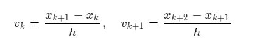
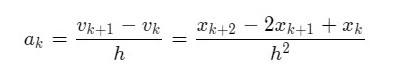
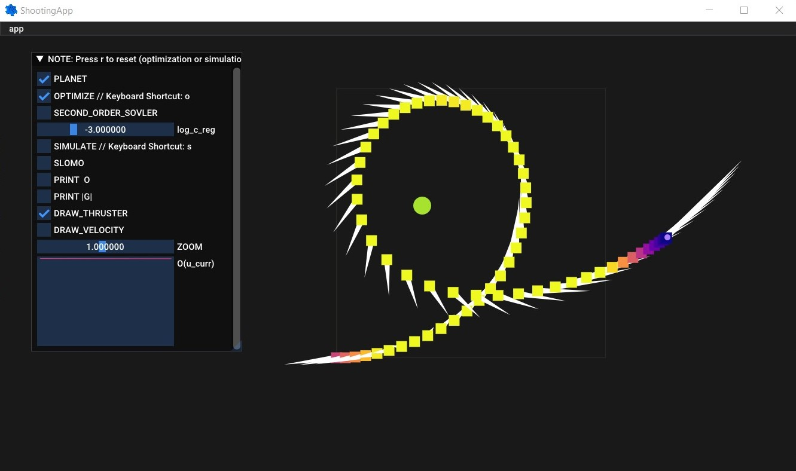

# Assignment 6 - Trajectory Optimization

**Hand-in:** May 28, 2021, 18:00 CEST 

First Name: Chenhao

Last Name: Li

### Solution to Question 2:

Since

we get

### Solution to Question 5:

By printing values of `O`, we can observe that Newton's method converges in general within 2-3 steps. In comparison, gradient descent requires significantly more steps to converge.

This can be interpreted by the computation of direction of Newton's method, where it applies a coordinate transformation so that the gradient points directly towards the stationary point and converges the fastest in the current neighborhood.

### Solution to Question 7:

A successful trajectory optimization with existence of the planet is shown below.

Note: The weights for position and velocity errors might need to be adapted to get a faster and smoother convergence due to the presence of the planet.

### Solution to Question 9:

Gradient descent does not work in this case because it fails to take into account the significantly unbalanced penalty weights of different orders of magnitude in the objective function. The resulting function landscape is therefore greatly squeezed in some gradient directions while streched in the others. This numerically ill-conditioned problem incurs an optimization along only certain dimensions while making nearly no progress on the others.

### Explanation of your approach to Question 10 (required for full credit):

To ensure the spaceship stays in the desired orbit within the required number of frames, a prediction of its state for 100 frames after the thrust disappears has been made. For each frame in the prediction horizon, it has to satisfy
- the distence between the spaceship and the planet remains `r_prime`
- the direction of the velocity of the spaceship is orthogonal to radius of the orbit
- the magnitude of the velocity of the spaceship induces the desired centripetal force

To this end, soft constraints have been enforced on the conditions mentioned above and the weights of the corresponding penalties have been fine-tuned to guarantee an efficient convergence (within 1 second). A perfect circular trajectory can be expected through this method.

One may also apply a shorter prediction horizon to further reduce computational complexity (not necessary though). While this still yields decent tracking performance, however, it might lose precision on orbiting on a perfect circle.

---

Assignment writeup: http://crl.ethz.ch/teaching/computational-motion-21/slides/Tutorial-Write-Up-6.pdf

---

- NOTE: Don't forget to switch to Release mode or Release With Debug Info otherwise it's gonna be just unimaginably slow.
- NOTE: Tested builds: GCC 9.3 (Linux), Visual Studio 2019 (Windows), Clang 12.0.0 (Mac OS)
