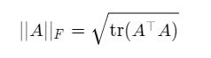
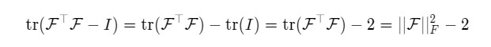

First Name: Chenhao

Last Name: Li

YouTube video demos please click [here](https://youtube.com/playlist?list=PLhqs0Oka9VRFpxypd4CeCbpo76Ppyhvgz).

---

Solution to Question 4:

Recall the definition of the Frobenius norm

Hence, by linearality of trace, we get

---

Solution to Question 10:

The objective function has yet only addressed the cost induced by position deviation. As a result, the gradient applied during gradient descend method on the input components corresponding to positions ($x_L, y_L, x_R, y_R$) are significantly larger than those corresponding to the angles ($\theta_L, \theta_R$). And this results in the fact that the handles translate dramatically while barely rotate. In other words, the large difference between the gradient scales has caused an unbalanced optimization direction, where translation is emphasized while rotation is almost neglected.

---

Solution to Question 11:

To reduce the distortion occurs at the ends of the soft bar, a regularizer is implemented so as to penalize the angle difference between the calibration line connecting the two feature points and the angle components of the control input ($\theta_L, \theta_R$). This guarantees the alignment of handles with the overall direction of the bar.

For the video demo please click [here](https://youtu.be/6sYgWQbPhCg).

As shown in the video, the simulation behaves fairly well when the two feature points are relatively distant from each other. However, a slow convergence or oscillation can be observed when the two feature points are relatively close. Moreover, unwanted alignment occurs when they are close enough.

For the video demo of this case please click [here](https://youtu.be/m7PHJfhTG-Q).

An alternative approach has been tested where the calibration line calculated at both ends respectively is used instead of the one defined by the two feature points. This guarantees a stable convergence and also rules out the drawback of the regularizer implemented above. However, the convergece is much slower.

Future work could be done to penalize the unbalanced scales of gradient in different directions, where turning this metric at the energy level might require more involving work.

---

Assignment writeup: http://crl.ethz.ch/teaching/computational-motion-21/slides/tutorial-a4.pdf

---

Could use ./build.sh on Linux/MacOS
