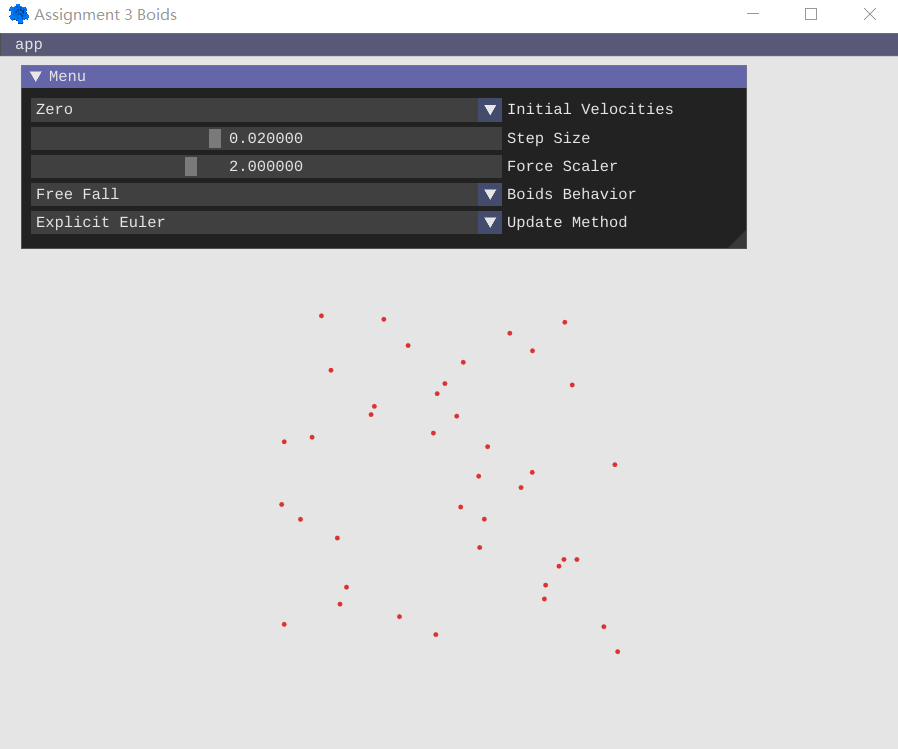
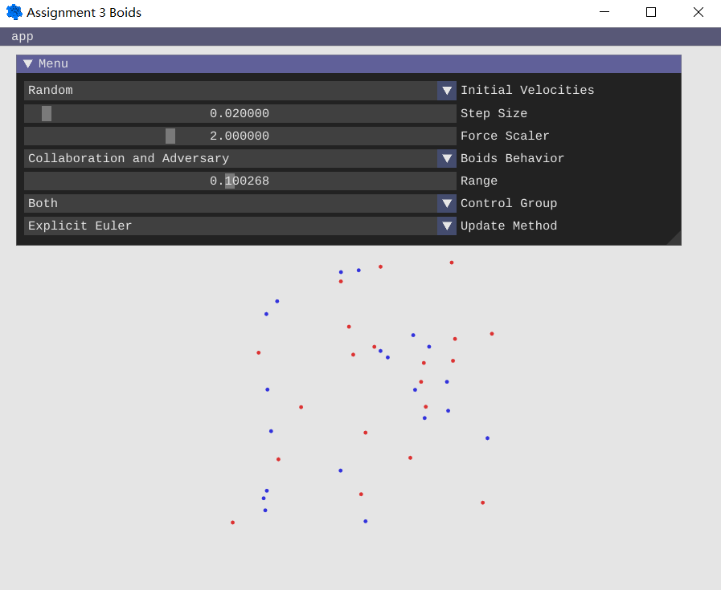

# Assignment 3 - Boids

## Demos

YouTube video demos please click here.

## Interface

The interface of the program is shown below.

*Figure 1: Overview of interface layout.*

There are several features that you can choose:
- Initial Velocities
- Step Size
- Force Scaler
- Boids Behavior
- Update Method

## Initial Velocities

This feature denotes the initial velocities of the Boids when initializing the system. Four options are offered:
- Zero
  - zero initial velocities
- Orthogonal
  - initial velocities are orthogonal to the initial positions. This feature aims to implement the *circular motion* of Boids as required.
- Random
  - random initial velocities
- Random Positive
  - random initial velocities with only positive values

## Step Size

This feature denotes the value of step size in the discretized system dynamics. A recommended value of 0.02 has been set as default.

## Force Scaler

This feature denotes the value of gain in force calculation, i.e. a scaling factor.

## Boids Behavior

This feature denotes the Boids behaviors required to be implemented including:
- Free Fall
- Separation
- Alignment
- Cohesion
- Leading
- Circular
- Collision Avoidance
- Collaboration and Adversary

### Free Fall

A *constant gravity* is applied on each Boid.

### Seperation

A slidebar will pop up and you can change affecting range of the behavior.

If two Boids have a distance smaller than the range defined above, a repulsive force that is *inversely proportional to the square of the distance* will be applied. In order to generate a mild force feedback and reduce overshoot, an offset term is considered in the force formulation.

### Alignment

A slidebar will pop up and you can change affecting range of the behavior.

For Boid i, if another Boid j lies within the range defined above, j is collected as a neighbor of i. The average position of the neighbors of Boid i and their distance inbetween will then be calculated and an attractive force that is *proportional to the distance* will be applied on Boid i. Meanwhile, in order to align velocity with the surrounding counterparts, a Boid will be applied a force induced by the *difference of velocity directions* between the average velocity of its neighbors in the range and itself.

### Cohesion

A slidebar will pop up and you can change affecting range of the behavior.

For Boid i, if another Boid j lies within the range defined above, j is collected as a neighbor of i. The average position of the neighbors of Boid i and their distance inbetween will then be calculated and an attractive force that is *proportional to the distance* will be applied on Boid i. In order to generate a mild force feedback and reduce overshoot, a PD controller is considered in the force formulation.

### Leading

A slidebar will pop up and you can change affecting range of the behavior. In addition, a checkbox of the presence of an obstacle will appear. If the obstacle is enabled, you can further change its position and radius in the slidebar showing up.

*Figure 2: Overview of leading layout.*

In this feature, a Boid colored blue is assigned as the leader, whose trajectory can be instructed by cursor click on the screen. This is realized in like manner as above where a PD controller is implemented considering the target and current state.

As for the followers, if the distance between a following Boid and the leader is smaller than the range defined above, an attractive force that is *proportional to the distance* will be applied. Meanwhile, a following Boid will be applied a force induced by the *difference of velocities* between the leader and itself so as to head in the same direction as the leader.

In addition, if two Boids are too close, a repulsive force that is *inversely proportional to the square of the distance* will be applied so as to maintain a sufficient
distance to each other.

How a force to avoid obstacle is generated will be explained later in Collision Avoidance feature.

### Circular

Please select the initial velocities to be orthogonal to initial positions to visualize the implementation of this feature.

A *constant centripetal force* is applied on each Boid so as to encourage circular motion in the plane.

### Collision Avoidance

An obstacle is enabled and a slidebar determining its position and radius will pop up.

If a Boid has a distance from the obstacle center smaller than the obstacle radius, a repulsive force that is *inversely proportional to the square of the distance* will be applied. In order to generate a mild force feedback and reduce overshoot, an offset term is considered in the force formulation. To avoid Boids bursting into the obstacle, the positions of Boids will be reset to the surface of the obstacle once that happens.

### Collaboration and Adversary

The Boids are *divided into two groups* and colored with red and blue respectively. A slidebar will pop up and you can change affecting range of the behavior. Meanwhile, you can choose the control strategy to be applied on which group in the dropdown menu showing up.

*Figure 2: Overview of collaboration and adversary layout.*

As described in the instruction, the evolution of the system respects the following rules:
- if two Boids from the same group are sufficiently close, a third one is created.
- if three Boids from the same group are close to a Boid from the other group, the latter one is removed from the
system.

To divide the Boids into two groups, a group assignment is generated to determine which group each Boid belongs to. In addition, to avoid infinite reproduction which slows down the computation, a reproduction limit of one is considered where *each Boid is allowed to generate only one child* if the conditon of the first rule is fulfilled. This information is termed as reproduction permission, where 0 denotes reproduction allowed and 1 denotes not. Together with group assignment, the information of each Boid is stored in a matrix called `group_label`, where each column corresponds to a Boid and *consists of two entries* - the first one represents the group assignment while the second one represents the reproduction permission.

These rules are realized by dynamically adding or removing a Boid (a column) in or from `positions` and `velocities` when the conditions are fulfilled. It is worth noting that the newly added Boid is positioned and has a velocity at the average positions and velocities of its parents.

Besides the implementation of the Boids behavior, a force control strategy is also adaptively applied.

For Boid i, if another Boid j lies within the 5.0 * range specified by the slidebar, j is collected as a neighbor of i. The average position of the neighbors of Boid i and their distance inbetween will then be calculated and an attractive force that is *proportional to the distance* will be applied on Boid i, which encourages the Boids from the same group to form large communities. In order to generate a mild force feedback and reduce overshoot, a PD controller is considered in the force formulation. This strategy promises two aspects that motivates the increment of the group relative size. On the one hand, the reproduction allowed group members are to be gathered so as to generate child Boids. On the other hand, all Boids from the same group including the reproduction prohibited group members are collected to prevent from bursting into the adversarial group communities and being eliminated.

In addition to the force between Boids from the same group, a *repulsive* force is acted on a Boid if there are more Boids within 5.0 * range from the different group than those from the same group by at least 3. The intuition behind is simple - when there are more adversaries than companions, the Boid will drive away to prevent from being eliminated. Conversely, in the case where there are more companions than adversaries by at least 3, in order to increase the relative group size, an *attractive* force is applied to the Boid to encourage its motion along with its community towards the community from the other group so as to eliminate the counterparts.

Finally, if two Boids are too close, a repulsive force that is *inversely proportional to the square of the distance* will be applied so as to maintain a sufficient
distance to each other.

Please refer to the code annotation for a detailed documentation of realization.

### Recommended Parameter

To observe an articulated simulation result, a set of recommended parameters are provided. In most cases, they are set to be the default value. An overview of recommended parameters is listed here:

| Initial Velocities | Step Size | Force Scaler | Boids Behavior              | Range |
| ------------------ | --------- | ------------ | --------------------------- | ----- |
| -                  | 0.02      | 2.00         | Free Fall                   | -     |
| -                  | 0.02      | 2.00         | Separation                  | 0.50  |
| -                  | 0.02      | 2.00         | Alignment                   | 0.50  |
| -                  | 0.02      | 2.00         | Cohesion                    | 0.50  |
| -                  | 0.02      | 2.00         | Leading                     | 0.50  |
| Orthogonal         | 0.02      | 2.00         | Circular                    | -     |
| -                  | 0.02      | 2.00         | Collision Avoidance         | -     |
| -                  | 0.02      | 2.00         | Collaboration and Adversary | 0.10  |
